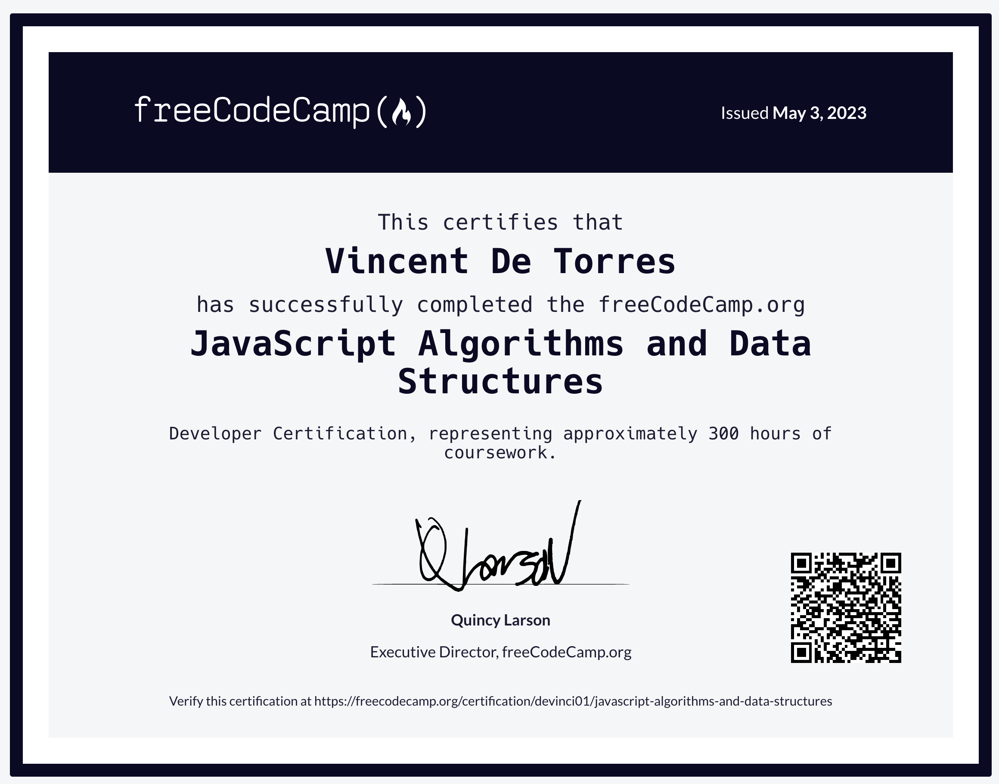

# __freeCodeCamp | Java Script Algorithms and Data Structures__

## __Certificate__
---

<figcaption> Verify certification <a href='https://www.freecodecamp.org/certification/devinci01/javascript-algorithms-and-data-structures' >here.</figcaption>

---
Compilation of projects required to complete the `Java Script Algorithms and Data Structures Certification`.  Linked is the course [curriculum](https://www.freecodecamp.org/learn/javascript-algorithms-and-data-structures) ; you can also find other courses being offered for free.Visit their website at [freeCodeCamp](freecodecamp.org/learn) to learn more.

## __Course Description__
---

JavaScript Algorithms and Data Structures
While HTML and CSS control the content and styling of a page, JavaScript is used to make it interactive. In the JavaScript Algorithm and Data Structures Certification, you'll learn the fundamentals of JavaScript including variables, arrays, objects, loops, and functions.

Once you have the fundamentals down, you'll apply that knowledge by creating algorithms to manipulate strings, factorialize numbers, and even calculate the orbit of the International Space Station.

Along the way, you'll also learn two important programming styles or paradigms: Object Oriented Programming (OOP) and Functional Programming (FP).

